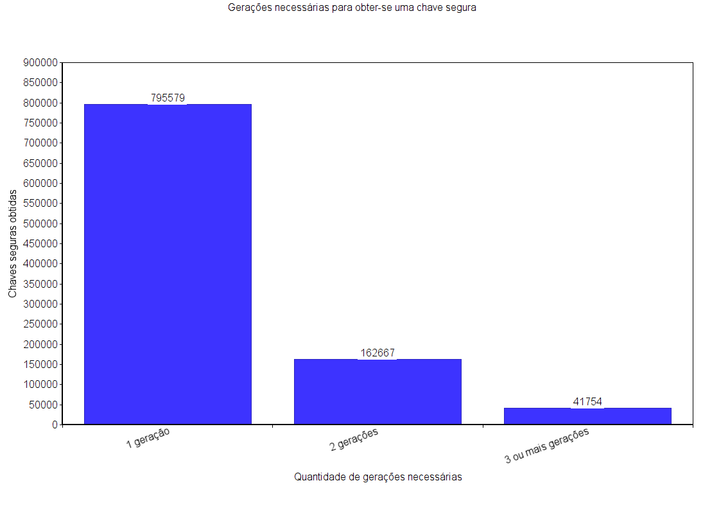
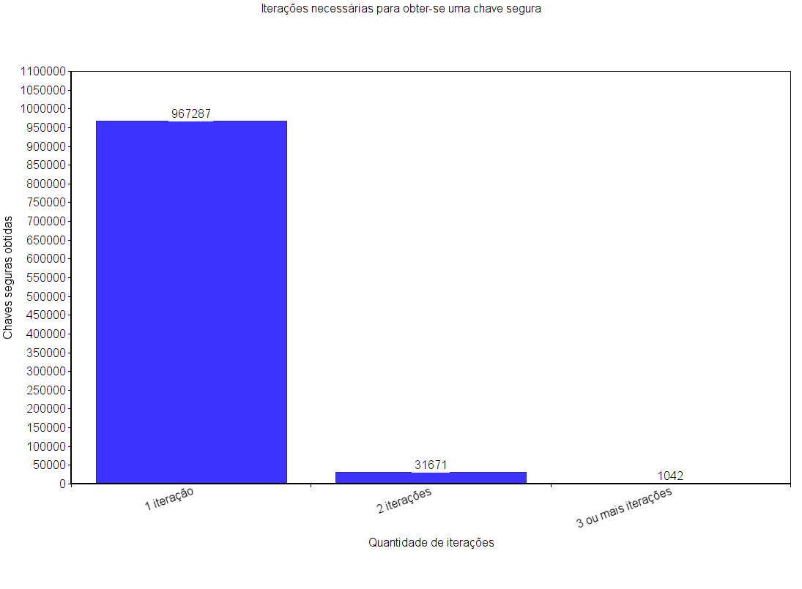

O artigo **Implication of Genetic Algorithm in Cryptography to Enhance Security** propõe um algoritmo genético cuja finalidade é gerar chaves seguras para criptografia de dados. O algoritmo utiliza uma combinação de caracteres ASCII e números primos para gerar os indivíduos. Os autores basearam-se na [entropia de Shannan](https://pt.wikipedia.org/wiki/Entropia_da_informa%C3%A7%C3%A3o#Entropia_como_conceito_da_Teoria_da_Informa%C3%A7%C3%A3o) para mensurar a qualidade das chaves geradas, sendo que uma chave é considerada suficientemente segura se a sua entropia for maior ou igual a 0.95.

Neste repositório há o PDF do artigo original e dois scripts escritos na linguagem Python. O `artigo.py` implementa o algoritmo proposto no artigo, enquanto o `basico.py` gera chaves utilizando somente a função `random` padrão da biblioteca Python, ou seja, a abordagem mais simples possível. A intenção deste repositório é verificar se o algoritmo proposto no artigo realmente gera chaves mais seguras.

O algoritmo proposto no artigo foi executado um milhão de vezes. O gráfico abaixo mostra quantas gerações foram necessárias pra obter-se uma chave suficientemente segura (isto é, uma chave com entropia maior ou igual a 0.95).

Em 795579 execuções, a chave segura foi obtida logo na primeira geração. Já em 162667 oportunidades foi necessário uma segunda geração. Nas outras 41754 execuções, três ou mais gerações foram necessárias.

O algoritmo básico, que utiliza apenas a função `random` do Python, também foi executado um milhão de vezes. O gráfico a seguir mostra quantas iterações foram necessárias pra obter-se uma chave com entropia de pelo menos 0.95.

Uma chave segura foi obtida já na primeira tentativa em 967287 execuções. Em 31671 execuções foi preciso iterar duas vezes. Em apenas 1042 vezes o algoritmo precisou de mais de duas iterações.

Ambos os testes foram realizados em um computador com Windows 10.

Com isso, conclui-se que o algoritmo proposto no artigo é inferior à abordagem básica, pois precisa de mais esforço computacional para gerar chaves igualmente seguras.
